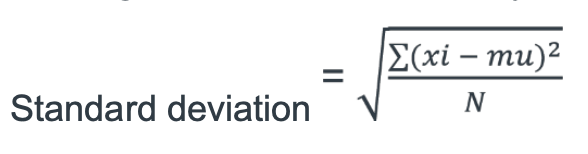
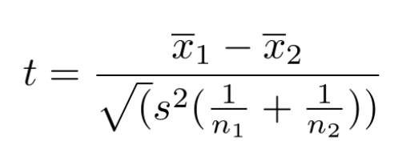
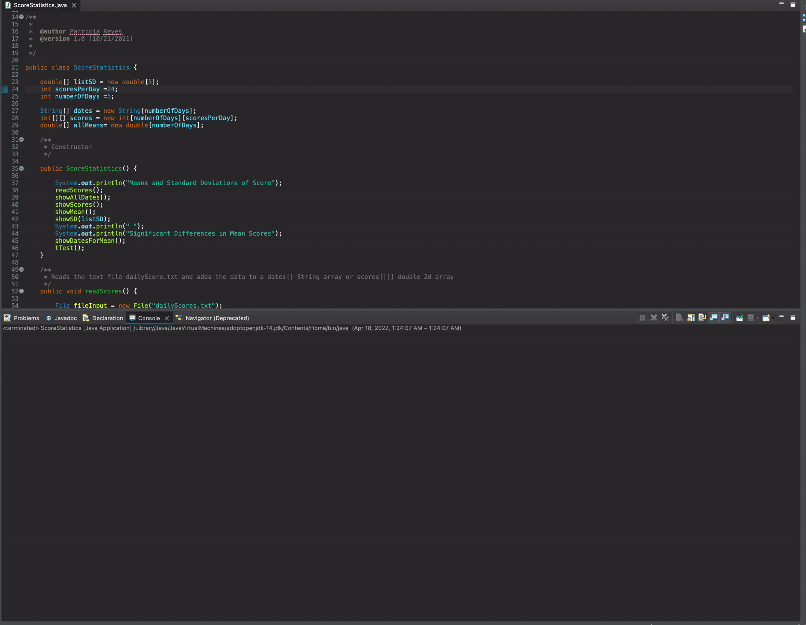

# Statistical-Calculations

- This program will perform statistics on student scores for several days. 

- The program will read data from a file named "dailyScores.txt." The first five items in the file are strings corresponding to the dates of the data. 

- Following the dates will be doubles that represent data pertaining to scores for five days. For simplicity. Note that all the scores for a day are consecutive 

- There will be 24 scores for each day. 

- The program then will read the values into a two-dimensional array to hold them so the program won’t have to keep reading the file 

- The program also looks for differences among the various mean values using a student t-test 

- The program computes the mean (average) score for each day and the standard deviation (variability) in scores for each day. 

- The mean score is computed by adding up all the individual scores and dividing them by the total number of scores for the day. 

The standard deviation is computed by: 

	1.	computing the mean score. 
  
	2.	going through a loop for each score in which you :  
	•	subtract the mean score from the current score 
	•	square that results 
	•	accumulate that result into a total (these steps compute the numerator in the expression under the radical below)
  
	3.	Divide the number computed in the loop above by the number of scores (N). This step provides the value under the radical in the formula.
  
	4.	Take the square root of that result - this is the standard deviation of the list of scores. 
  
- This algorithm is summarized by the following standard deviation formula:

- where: 
N is the number of items (temperatures in this case: 24) 
- Sigma indicates “the sum of”
- xi is the ith item on the list
- mu is the mean value of the items on the list 

- Computing the differences between means 

- The program will do pair-wise T-tests on the means (we could use a single analysis of variance (ANOVA) but we will stick with T-tests). 

